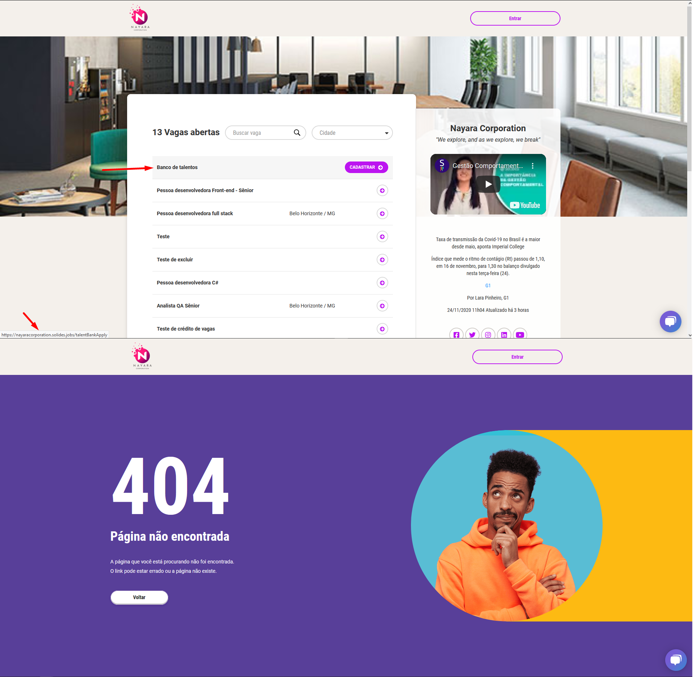

# Automação com Selenium
- Fluxo de Candidatura no banco de talentos
- Criação dos arquivos Gherkin
- Criação dos scripts de automação

## Pré-configuração
- Download do [ChromeDriver](https://chromedriver.chromium.org/downloads)
- Adicionar as váriaveis de ambiente o caminho para o path do chromedriver

- Realizar o clone do projeto
- Executar o `bundle install` para instalar as gems

## Execução dos testes
- `cucumber`: executa todos os cenários
- `cucumber -t '@tag'`: executa cenário específico de acordo com a tag

## Execução da análise de código estática
- `rubocop`: executa a análise de código estática com o rubocop
_____

## Report de bugs
### Link com redirecionamento não encontrado
Ao clicar sobre o texto "Banco de talentos" há um href para "talentBankApply" no qual a página não é encontrada (status 404).
Segue evidência do incidente.

